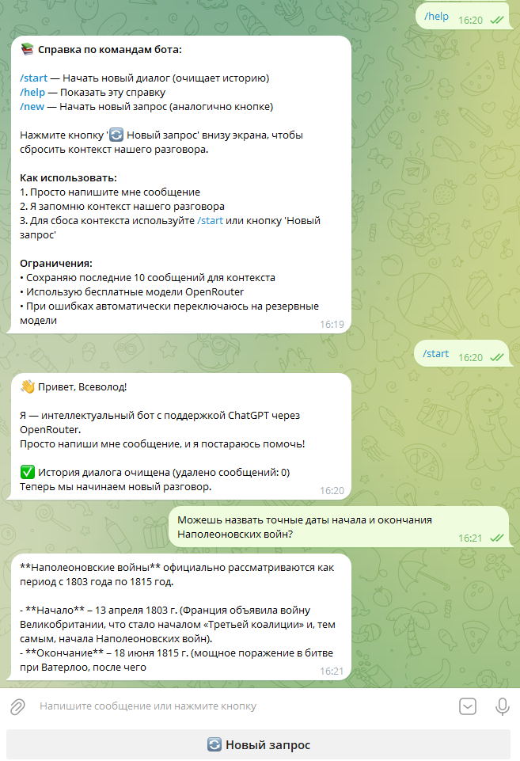

# 🤖 Telegram ChatGPT Бот с памятью

Телеграм-бот на Python, интегрированный с ChatGPT через OpenRouter API, с сохранением контекста разговора и автоматическим переключением между моделями.

---

## ✨ Возможности

- **🧠 Интеллектуальные ответы** через OpenAI-совместимые модели (OpenRouter)
- **💬 Полная история диалога** — бот помнит контекст предыдущих сообщений
- **🔄 Автопереключение моделей** — при недоступности основной модели используются резервные
- **⚡ Асинхронная архитектура** — высокая производительность с aiogram и SQLAlchemy
- **🗃️ Локальное хранение истории** — SQLite база данных с ORM SQLAlchemy
- **🎛️ Гибкая конфигурация** — настройки через .env файл с валидацией Pydantic
- **🛡️ Ограничение запросов** — настраиваемые дневные лимиты на пользователя

---

## 🏗️ Технологический стек

| Компонент | Технология |
|-----------|------------|
| **Фреймворк Telegram** | aiogram 3.x (асинхронный) |
| **База данных** | SQLAlchemy 2.0 + aiosqlite (SQLite) |
| **Конфигурация** | Pydantic Settings + python-dotenv |
| **AI-интеграция** | OpenRouter API (OpenAI-совместимый) |
| **Архитектура** | Модульная с внедрением зависимостей |

---

## 📋 Требования

- Python 3.8 или выше
- Токен Telegram бота (получить у [@BotFather](https://t.me/botfather))
- API ключ OpenRouter (получить на [openrouter.ai](https://openrouter.ai))

---

## Скриншоты



---

## 🚀 Быстрый старт

### 1. Клонирование и настройка

```
# Клонируйте репозиторий
git clone <url этого репозитория>
cd <корень проекта (ваше название)>

# Создайте виртуальное окружение (рекомендуется)
python -m venv venv

# Активация на Windows:
venv\Scripts\activate
# Активация на Linux/Mac:
source venv/bin/activate

# Установите зависимости
pip install -r requirements.txt
```

---

### 2. Конфигурация

Создайте файл .env в корне проекта:

```
# Токен Telegram бота от @BotFather
BOT_TOKEN=ваш_токен_бота_здесь

# API ключ OpenRouter (получить на https://openrouter.ai)
OPENROUTER_API_KEY=ваш_api_ключ_здесь

# Дополнительно: информация о сайте для OpenRouter
OPENROUTER_SITE=https://example.com
OPENROUTER_TITLE=MyTGChatbot

# Настройки моделей ИИ
OPENROUTER_MODEL=openai/gpt-oss-20b:free
OPENROUTER_FALLBACK_MODELS=["openai/gpt-5-mini", "openai/gpt-5.2-chat"]

# Ограничения использования
TEXT_DAILY_LIMIT=200
CHAT_WINDOW_LIMIT=30
```

---

### 3. Инициализация базы данных

База данных создастся автоматически при первом запуске. Для ручной инициализации:

```
# Создайте папку data
mkdir data

# Или дайте боту создать её автоматически при старте
# Запустите бота
python main.py
```

---

### 🎯 Команды бота

```
# Начать новый диалог (очищает историю)
/start

# Показать справку по использованию
/help

# Сбросить контекст разговора
/new	
```
Бот также имеет inline-кнопку "🔄 **Новый запрос**" для сброса контекста диалога.

---

### 📁 Структура проекта

```
tg_chatgpt_bot/
├── main.py                 # Точка входа приложения
├── .env                    # Переменные окружения (не в git)
├── requirements.txt        # Зависимости Python
├── data/                   # Директория базы данных (создается автоматически)
│   └── db.sqlite          # Файл базы данных SQLite
├── bot/                    # Основной пакет
│   ├── __init__.py
│   ├── main.py            # Основная логика бота
│   ├── config.py          # Управление конфигурацией
│   ├── database.py        # Подключение и настройка БД
│   ├── models.py          # ORM-модели SQLAlchemy
│   ├── handlers/          # Обработчики команд Telegram
│   │   ├── commands.py    # /start, /help, /new
│   │   ├── messages.py    # Обработка текстовых сообщений
│   │   └── buttons.py     # Обработчики inline-кнопок
│   ├── services/          # Сервисы бизнес-логики
│   │   ├── history.py     # Управление историей диалогов
│   │   └── openrouter.py  # Интеграция с OpenRouter API
│   └── middlewares/       # Промежуточное ПО
│       └── throttling.py  # Ограничение запросов
└── tests/                 # Тестовые файлы
```
---

### 🐳 Деплой в Docker

```
# Dockerfile
FROM python:3.9-slim

WORKDIR /app

COPY requirements.txt .
RUN pip install --no-cache-dir -r requirements.txt

COPY . .

CMD ["python", "main.py"]
```
Сборка и запуск:
```
docker build -t telegram-chatgpt-bot .
docker run -d --name chatgpt-bot --env-file .env telegram-chatgpt-bot
```

---

### Логирование

Бот использует модуль logging Python. Для увеличения детализации измените в `main.py`:

```
logging.basicConfig(level=logging.DEBUG)  # Измените с INFO на DEBUG
```